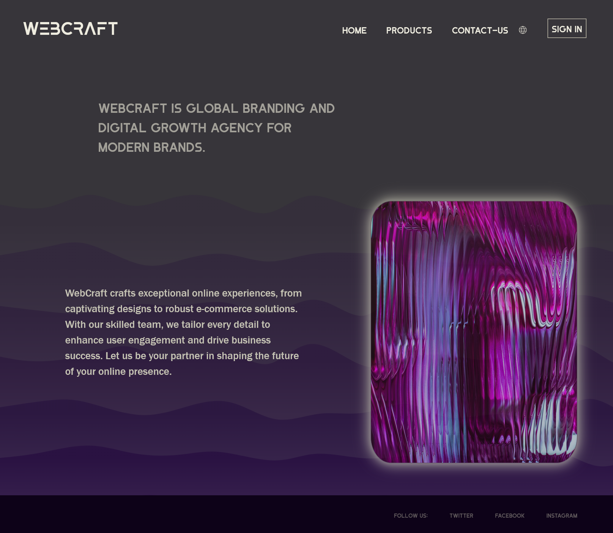
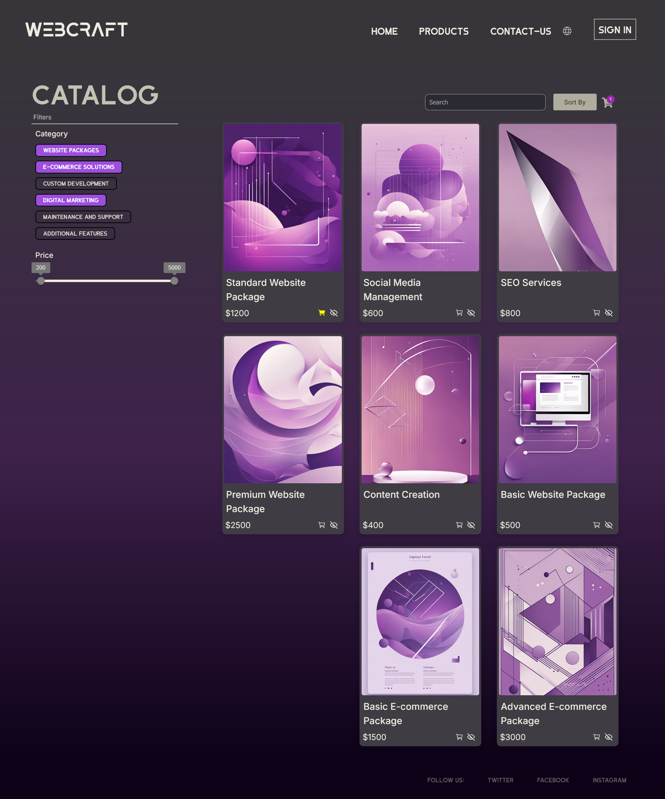

# 🌐 WebCraft – Elevate Your Brand Online  

WebCraft is a modern **marketing platform** designed to help businesses showcase their products and services effectively. Built with **React** and optimized with **Vite**, this project focuses on delivering a **fast, responsive, and user-friendly experience**.  

## 🚀 Features  

- 📱 **Fully Responsive Design** – Adapts seamlessly to all devices.  
- 🛒 **Dynamic Product & Service Showcase** – Engaging catalog layouts.  
- 🛍️ **Cart & Order Management** – Smooth shopping experience.  
- 🌍 **Multi-Language Support** – Reach a global audience.  
- ⚡ **Optimized with Redux** – For smooth state management and performance.  

## 📌 Components  

- **Landing Page** – A visually compelling introduction.  
- **Product & Service Catalog** – Interactive and informative.  
- **Shopping Cart** – Seamless management of selections.  
- **Contact & Inquiry Form** – Easy communication with clients.  

## 📷 Screenshots  
### Landing Page
  
### Catalog
  

## 🛠️ Tech Stack  

- **React** – Component-based UI development.  
- **Redux** – State management for carts & interactions.  
- **Vite** – Lightning-fast development environment.  
- **CSS & Google Fonts** – Aesthetic, modern styling.  

## 🚀 Getting Started  

1️⃣ Install the necessary dependencies:
```sh
npm install
```
2️⃣ Start the development server:
```sh
npm run dev
```
